# Claude Code Setup Overview

Doc ➔ <https://code.claude.com/docs/en/overview>

commit **[00 initial commit](https://github.com/simotae14/claude-code-practical-guide/commit/d9ca7542661fa566e0862492ab3146b4e068fa10 "00 initial commit")**

## Starting Project:

<https://github.com/academind/claude-code-course-resources/blob/main/code-snapshots/starting-project.zip>

## Base usage & Official VS Code Integration Documentation:

<https://code.claude.com/docs/en/vs-code>

commit **[01 Claude Base Usage](https://github.com/simotae14/claude-code-practical-guide/commit/0f91db8320dc85168068f8b0b6cb8649640d3631 "01 Claude Base Usage")**

commit **[02 Claude project config](https://github.com/simotae14/claude-code-practical-guide/commit/0d5e1cca8d659e944743958b756e0042f967df35 "02 Claude project config")**

commit **[03 Claude add project settings](https://github.com/simotae14/claude-code-practical-guide/commit/8546a4238be9db7468018dd621c555400350f531 "03 Claude add project settings")**

## Understanding Sessions & Context:

Per vedere quanto contesto è stato usato durante la sessione

```
/context
```

e ti mostrerà una cosa del genere

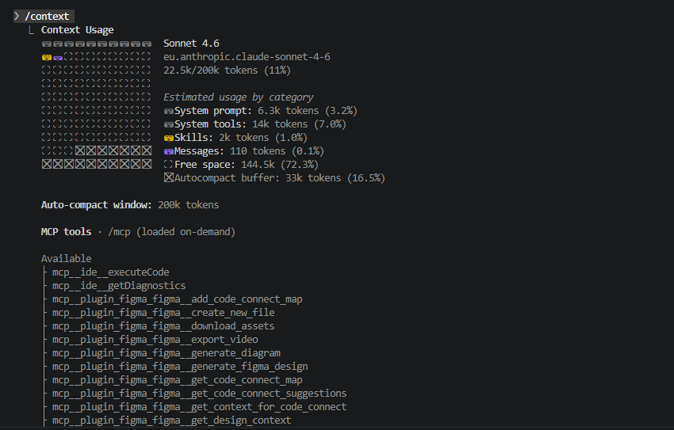

Altro comando è

```
/usage
```

che ti mostra l'uso rimanente che hai per il tuo piano claude
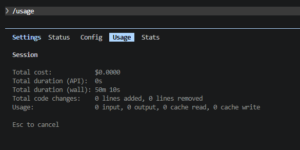

Per compattare manualmente una conversazione puoi usare il comando /compact
```
/compact
```

## Core Features

puoi invocare claude passandogli pure il prompt iniziale

es:

```
$ claude "explain this project"
```

ed otterrai
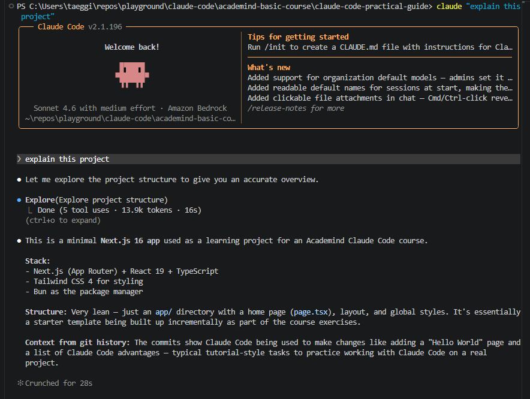

oppure puoi anche avviare Claude in background usando il **-p** flag, esegue ragionamento in background e appare solo quando ha la risposta

```
$ claude -p "explain this project"
```

ed otterrai
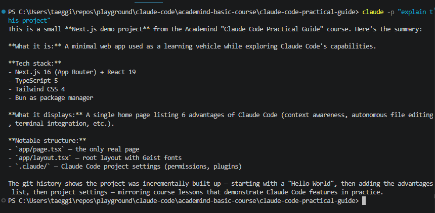

come si vede non c'è ragionamento, solo la risposta e poi in automatico chiude claude

<br />

per ripristinare una versione precedente puoi usare comando **resume**

```
/resume
```

e poi navigare le varie sessioni e ripristinarle
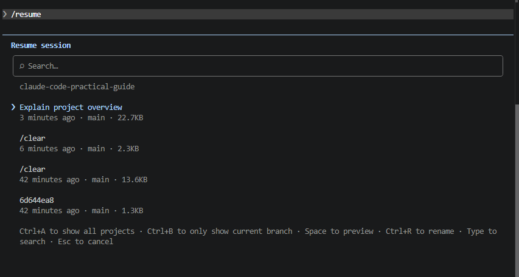

per avviare Claude con ultima sessione puoi usare il flag **-c**

```Shell
$ claude -c
```

ed otterrai
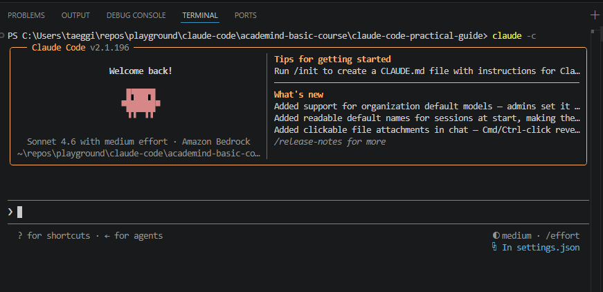

## Available Settings:

<https://code.claude.com/docs/en/settings#available-settings>

## Starting Project:

<https://github.com/academind/claude-code-course-resources/blob/main/code-snapshots/starting-project.zip>

## Advanced Permissions Management

Quando Claude deve fare qualcosa per cui non è sicuro di avere i permessi ti mostra un prompt di scelta

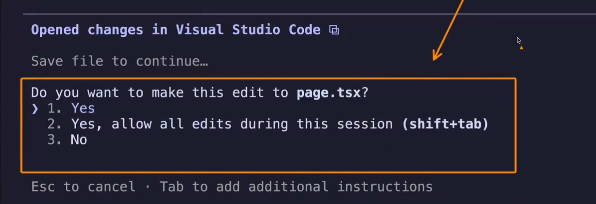

per garantire in modo permanente il permesso basta usare la combinazione di tasti Shift + Tab

oppure se voglio a prescindere cambiare il permesso di default basta cliccare Shift + Tab e dovrebbe permetterti di navigare i vari permessi

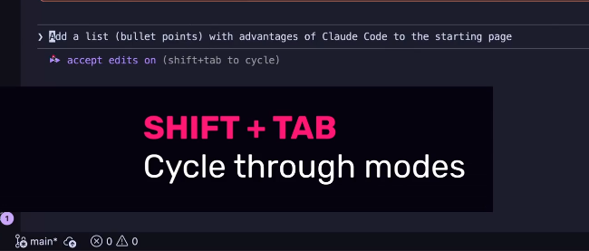

ad esempio col permesso settato sopra genererà la lista dei vantaggi senza chiederti alcun permesso

anche in sta modalità cmq non è permesso fare tutto ma solo editare il codice

esempio se gli chiedo di creare il comando di git commit

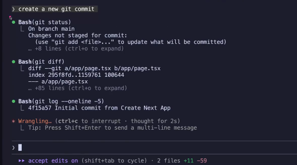
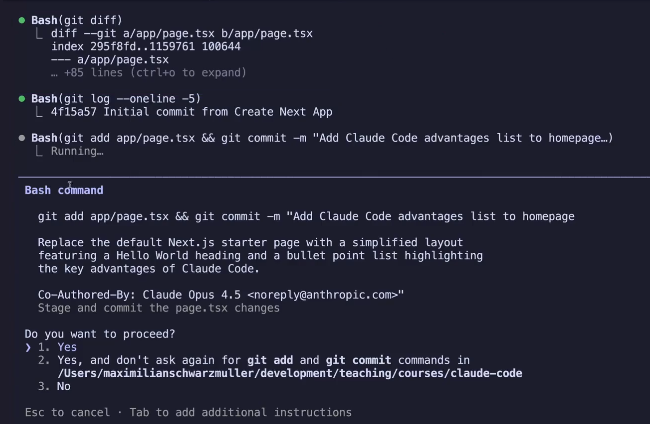

se invece volessimo avviare claude senza che chieda permessi per nulla bisogna usare il flag **--dangerously-skip-permissions**

```Shell
$ claude --dangerously-skip-permissions
```

devi usarlo con molta parsimonia

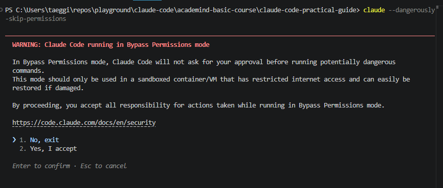

e se accetti avvia claude in sta modalità

## Running Claude Code via Docker Sandboxes
Per evitare di eseguire Claude con tutti i permessi e dargli possibilità di cancellare la memoria fisica possiamo creare una sandbox protetta di docker dove dare accesso solo ad un numero limitato di risorse scelte da noi a Claude.

```Shell
$ docker sandbox run claude
```
deprecato ora usare
```Shell
$ docker sbx run claude
```
entrambi non vanno con la versione recente di docker, cmq devi anche nel caso rifare login a claude dato che stai usandolo in un altro environment

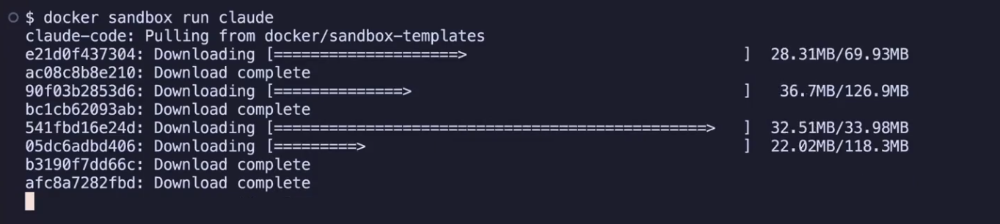
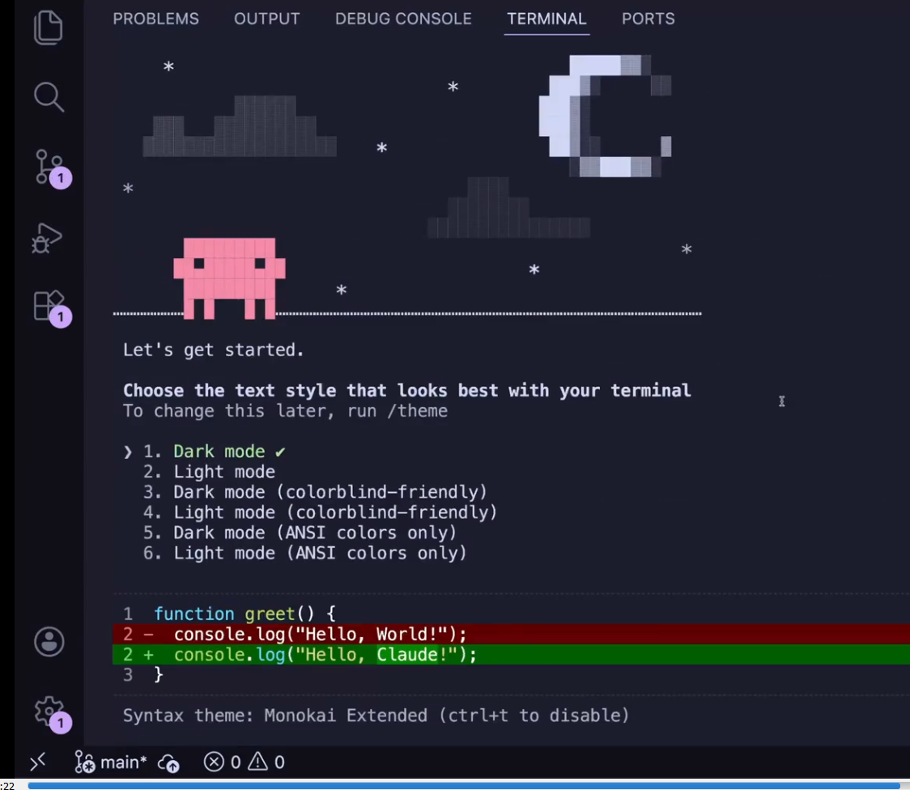

## Using Claude Code's Native Sandboxing
invece di usare docker puoi usare direttamente la sandbox nativa di claude code

semplicemente col comando
```
/sandbox
```
ti chiede che modalità di sandbox vuoi usare
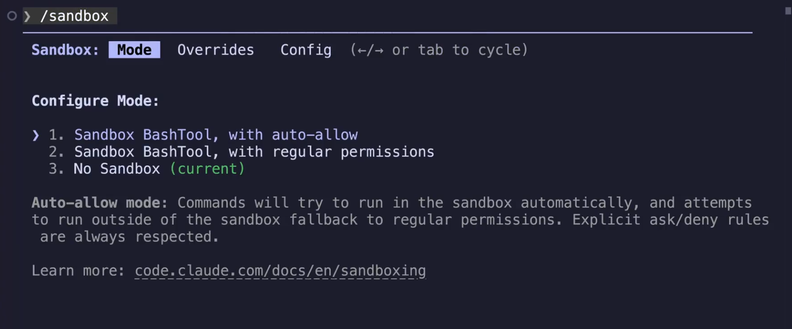
In windows non funziona, solo con macOs, Linux e WSL2 è supportato

Usiamo auto allow perchè l'idea stessa della sandbox è di creare un ambiente protetto dove poter fare tutto
Controlla anche accesso alla rete.

Una volta selezionato sandbox in automatico aggiorna anche i settings locali del progetto
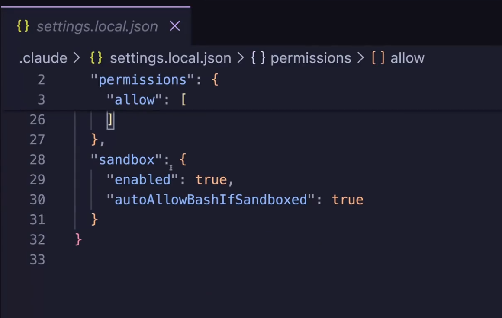

una volta fatto questo ogni volta che riapri una sessione claude in questo progetto sarà aperta in sandbox mode
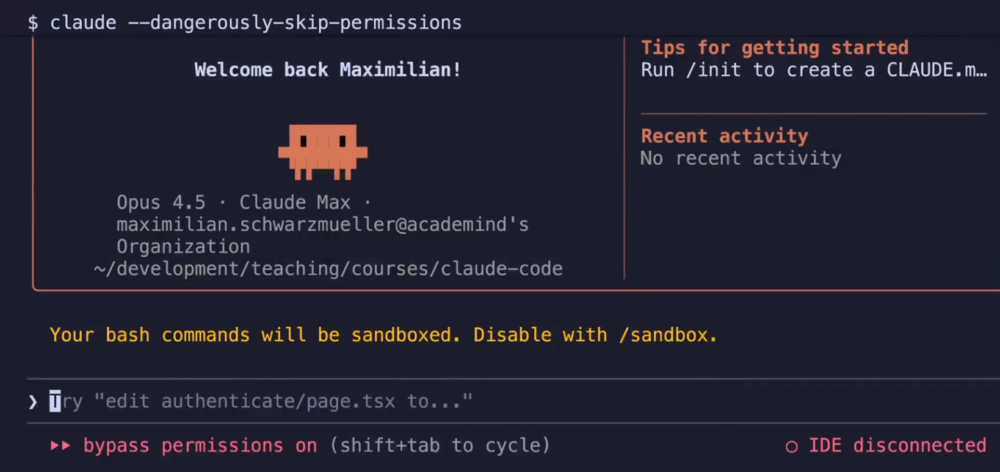
come vedi anche se eseguo in dangerous mode non ha accesso a tutto mio hard drive
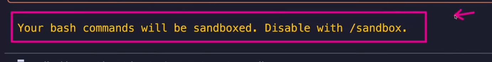

## Undoing Actions & The importance of version control systems
Permette di revertare alcune modifiche o annullarle
due modi
- premi due volte Escape (ESC) e ti mostrerà messaggio Rewind
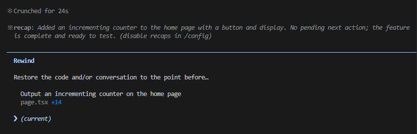
e posso scegliere da dove voglio revertare il codice, dove current indica lo snapshot corrente ma possiamo andare addirittura all'inizio della conversazione
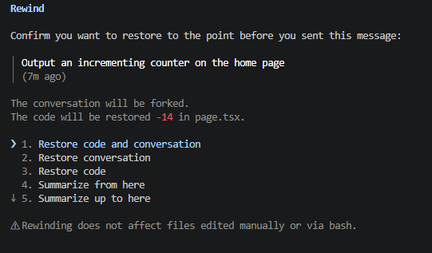
- usare il comando /rewind
```
/rewind
```
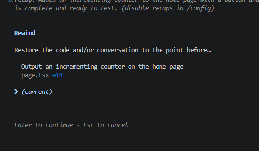
e ti permette sempre di selezionare a che punto tornare

# Using Claude Code
## Intro
Vediamo ora l'uso vero e proprio di Claude Code
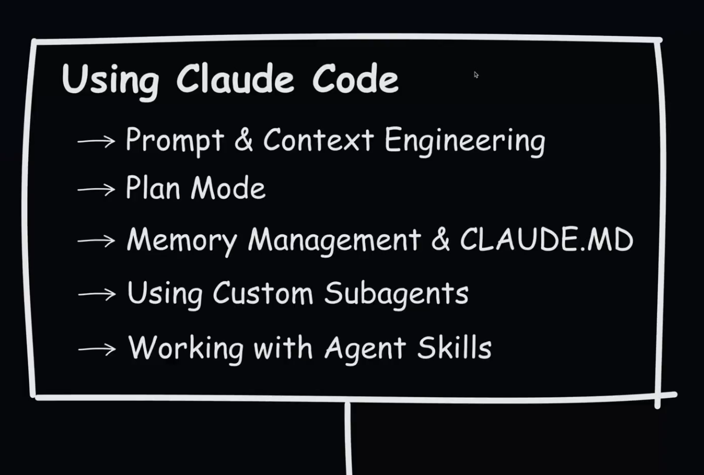
Come usare il Prompt & Context Engineering
Vedremo il Plan Mode
la gestione della memoria e CLAUDE.md
Usare subagents custom
E lavorare con le Agent Skills

## Making Sense of Prompt & Context Engineering
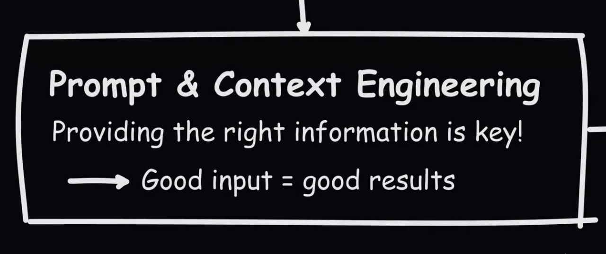
un miglior input da migliori risultati

e un buon input è dato da 
- istruzioni specifiche
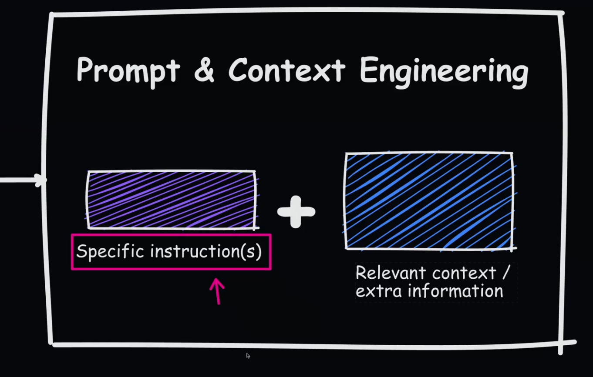
- un contesto rilevante
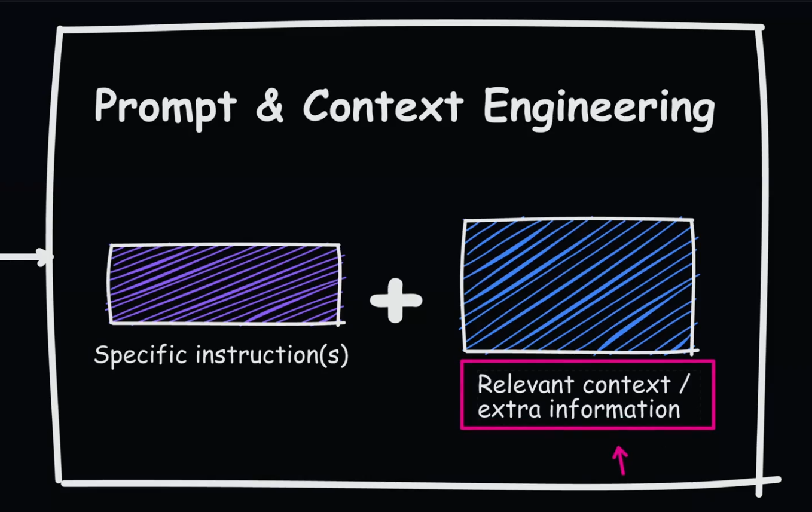

## Prompt Engineerging in Action & Working with Specs
Creaimo un app per prendere note usando un Rich Text Editor

iniziamo col prompt
di solito il documento con le specifiche lui lo elabora tramite AI
es:
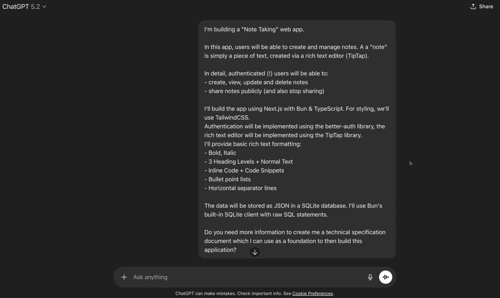
e col mio input ho chiesto a ChatGpt di crearmi un doc con le specifiche
ho salvato il contenuto delle specifiche e l ho salvato dentro a un file SPEC.md nella root del progetto
qui il risultato del file SPEC.md
<https://github.com/simotae14/claude-code-practical-guide/commit/cb72de4a80a272f0ecee8724e5d871a0d140d279>
ora in una nuova sessione di Claude code posso digitare un prompt in cui referenzio il file SPEC per dare contesto
Dobbiamo solo includere i file rilevanti per il Context

per andare a capo usare \ + Invio in claude
Inoltre per utenti e autenticazione vogliamo usar ela Better Auth library
che necessita di user in una determinata shape <https://better-auth.com/docs/concepts/database#user>
Copio la documentazione in Markdown
e la wrappo in dei tag xml che sono molto utili per fare comprendere
```
We're building an app described in @SPEC.md .
Please format this file as proper markdown.
  
Also update the file and update the part about the "users" table and auth-related tables.
We're using the better-auth library which expects a certain database structure.
  
Here's the official better-auth database documentation article:
<better-auth-database-docs>
[Pasted text #1 +1026 lines]
</better-auth-database-docs>
```
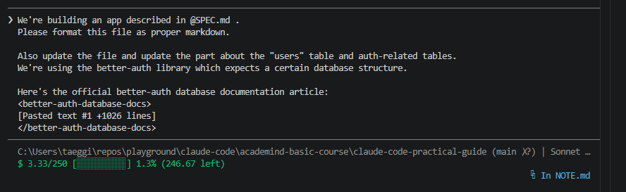
Dato che non voglio che mi chieda permessi posso schiacciare Shift+Tab per entrare in accept edits mood
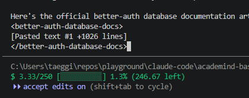

## SPEC.MD:
<https://github.com/academind/claude-code-course-resources/blob/main/code-snapshots/finished-project/SPEC.MD>

come risultato finale mi aspetto un markdown formattato correttamente e con tutte le info, controllare per bene output
[Commit: generazione e review dello SPEC markdown file](https://github.com/simotae14/claude-code-practical-guide/commit/d3229be44b81f2edab22583c55a3cfd258579ee5)

## Inizializzare un Progetto Claude
Cominciamo ad installare delle dipendenze per cui non mi serve aiuto di Claude ovvero
```
bun add better-auth zod @tiptap/react @tiptap/pm @tiptap/starter-kit
```
lo facciamo noi perchè spesso se Claude cerca di installare dipendenze modifica il package.json file aggiungendo versioni vecchie.

Inoltre installo un package che mi serve solo come dev dependency
```
bun add -D @types/bun
```

Apro una nuova sessione Claude code e ogni volta che apro un nuovo lavoro con claude code su un progetto, che sia nuovo o un repo già esistente
runno il comando /init
```
/init
```
che analizza il codebase e genera una sintesi dell'analisi su un file CLAUDE.md
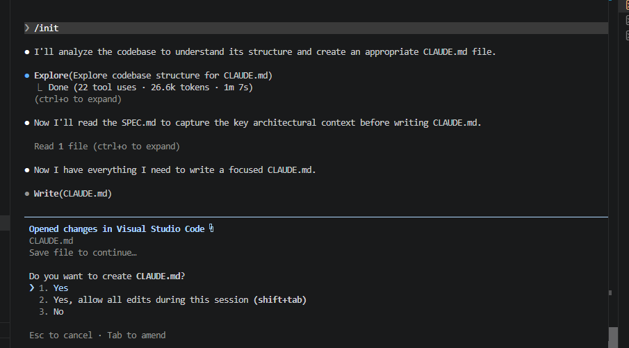
[Commit: init progetto e generazione CLAUDE.md file](https://github.com/simotae14/claude-code-practical-guide/commit/a092f86d27442511209b137a6fb2b7ce0b4e60f9)

## Crafting great CLAUDE.md files
Ogni repo deve avere almeno un Claude file alla root del progetto.
E viene caricato ad ogni sessione Claude Code sul repo.
Quindi non deve essere troppo lungo.

Andiamo ad aggiungere alcune cose custom all'inizio del Claude file specificando quando vogliamo che il file venga letto (ad esempio solo nel caso di task con scelte architetturali).
Poi chiedo di dare risposte estremamente concise e evitare lunghi snippet di codice dato che vanno ad influire sul contesto.
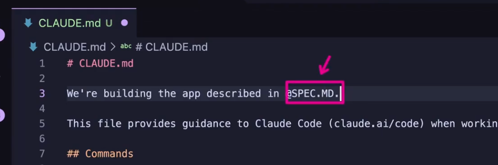
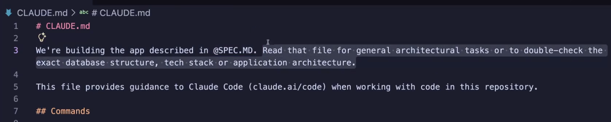
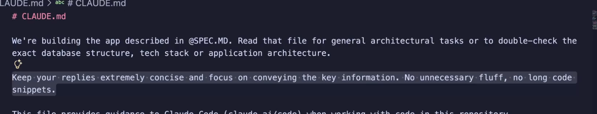

Posso poi aggiungere diversi Claude.md file in diverse subfolders, caricati solo quando Claude lavora sui files dentro quelle directories.

[Commit: customizzare il CLAUDE.md file](https://github.com/simotae14/claude-code-practical-guide/commit/6836ba575e18e7da982828ad143425d8dc515d7d)

## Cominciamo il Plan Mode
Creiamo una nuova sessione con questo prompt
```
Let's start building the application described in @SPEC.MD .

Start by setting up the whole structure. Only add a dummy message to each page. No actual page content yet.

Just create all those different page.tsx files for different application routes. Don't implement authentication yet.
```

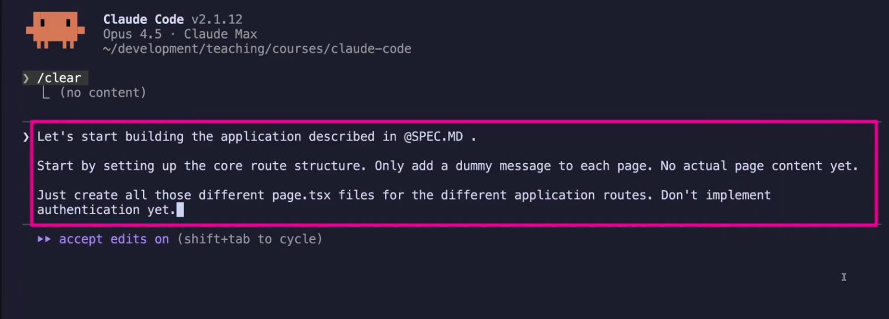
e con shift Tab switchare al Plan mode
modalità in cui raccoglie info e ti chiede chiarimenti se necessari

Esplora prima il codice e poi crea un piano da seguire.
Alla fine da una serie di opzioni se accettare il piano e eseguirlo, se approvare manualmente le varie modifiche
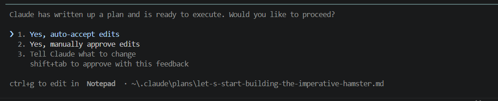
nella terza opzione posso anche dare più informazioni a Claude
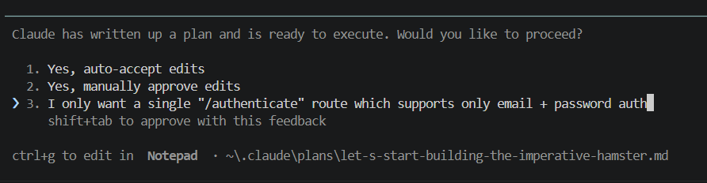
e poi una volta fatto seleziono "Yes, auto-accept edits"

[Commit: Accettare e lasciare implementare il Piano](https://github.com/simotae14/claude-code-practical-guide/commit/8511ad1bbcad0e67dd169d010acf7b225386da66)

## Uso dei Tools Built-in di Claude Code
Creo una nuova sessione e chiedo a Claude Code di implementare autenticazione e db access

```
Implement authentication and database access.

Add a "lib" folder with "auth.ts" and "db.ts" files. Export a db handle in the db.ts file and make sure WAL mode is used and all required database tables are created if they don't exist yet.
```
può riuscire a farlo perchè sono cose descritte nello SPEC file che è referenziato nel CLAUDE file.

volendo posso esplicitarlo cmq
```
Implement authentication and database access as described in @SPEC.md .

Add a "lib" folder with "auth.ts" and "db.ts" files. Export a db handle in the db.ts file and make sure WAL mode is used and all required database tables are created if they don't exist yet.
```
ma dato che usiamo Bun e Better-Auth e non lo stiamo esplicitando potremmo ottenere qualcosa di sbagliato da questo prompt.
quindi vale la pena aggiungere i riferimenti alla documentazione di questi tools

```
Implement authentication and database access as described in @SPEC.md .

Add a "lib" folder with "auth.ts" and "db.ts" files. Export a db handle in the db.ts file and make sure WAL mode is used and all required database tables are created if they don't exist yet.

Visit the official docs websites:
- https://bun.com/docs/runtime/sqlite
```
oppure scrivere esplicitamente di cercare la doc lui nel web

```
Implement authentication and database access as described in @SPEC.md .

Add a "lib" folder with "auth.ts" and "db.ts" files. Export a db handle in the db.ts file and make sure WAL mode is used and all required database tables are created if they don't exist yet.

Use web search to find the relevant documentation for Bun SQLite and better-auth setup (with next.js and Bun SQLite).
```
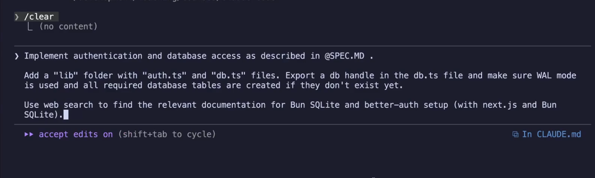

## Using MCP Servers and More on Permissions
[Link Documentazione](https://modelcontextprotocol.io/docs/getting-started/intro)

## Context7 MCP:

Un MCP server molto utile è Context7 [link repo](https://github.com/upstash/context7)
In grado di aggiungere al context la documentazione necessaria per usare determinati tools.

Nella pagina github ci sono pure le istruzioni per l'installazione

questa è installazione locale al progetto
```
claude mcp add context7 -- npx -y @upstash/context7-mcp
```
e dopo averlo aggiunto

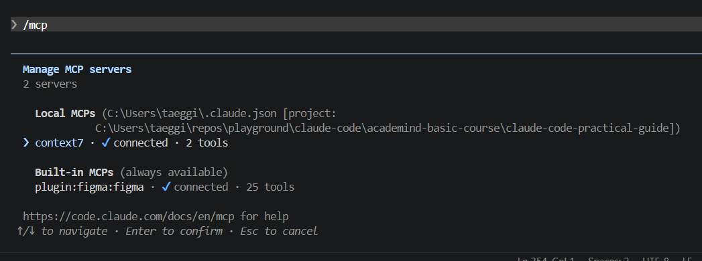

se invece lo voglio globale
```
claude mcp add context7 --scope user -- npx -y @upstash/context7-mcp
```

Ora posso riprovare prompt precedente aggiungendo anche mcp context7

```
Implement authentication and database access as described in @SPEC.md .

Add a "lib" folder with "auth.ts" and "db.ts" files. Export a db handle in the db.ts file and make sure WAL mode is used and all required database tables are created if they don't exist yet.

Use web search or context7 mcp to find the relevant documentation for Bun SQLite and better-auth setup (with next.js and Bun SQLite).
```
e lo lancio in plan mode

dato che è la prima volta che uso context7 mi chiederà permesso

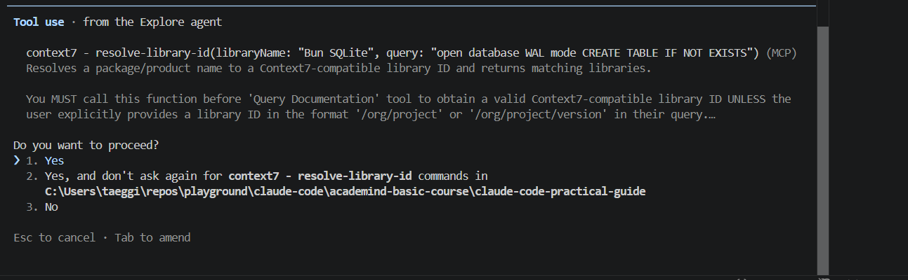

Accetto il suo piano e glielo faccio eseguire

[Commit Use Context7 MCP to implement autj and db access](https://github.com/simotae14/claude-code-practical-guide/commit/25691b00089d1bf10b4b50e65f6a997aaa6cbabd)

## Understanding Subagents
Mettiamo di voler usare Claude Code per valutare l'implementazione precedente.
```
We're building @SPEC.MD .

Please evaluate existing codebase to check whether authentication and database access are implemented correctly (in line with the expectations explained in SPEC.MD and the official documentation for the libraries / technologies used).

Use web search or context7 mcp to look up docs.
```
non lanciarlo ne in edit che in plan mode
mentre lo fa usa dei subagents, come l'explore in background
ogni puntino indica attività nel main agent ed invece quello che vediamo indentato è nel subagent

## Creating and Using a Custom Subagent
La lettura della documentazione con context7 avviene direttamente nel main context e quindi si mangia token
Quindi vale la pena creare un custom Documentation Explorer Subagent

per farlo nella cartella <strong>.claude</strong> vado a inserire una cartella <strong>agents</strong> e dentro ci metto il nostro file <em>DocsExplorer.md</em>

## DocsExplorer Agent:

<https://github.com/academind/claude-code-course-resources/blob/main/other/subagent/DocsExplorer.md>

Inoltre qui un link a tutti i tool disponibili in Claude
## Available Tools:

<https://code.claude.com/docs/en/settings#tools-available-to-claude>

al momento l'agent che abbiamo creato è locale al progetto ma possiamo anche metterlo come globale nel nostro pc aggiungendolo nella cartella <strong>.claude</strong> principale dove ci sarà lo stesso corrispettivo.

Riprovo ora in una nuova sessione Claude a lanciare sto prompt
```
We're building @SPEC.MD .

Please evaluate existing codebase to check whether authentication and database access are implemented correctly (in line with the expectations explained in SPEC.MD and the official documentation for the libraries / technologies used).

Use web search or context7 mcp to look up docs.
```
dovrebbe usare il nostro sub agent

[Commit: creazione subagent custom DocsExplorer](https://github.com/simotae14/claude-code-practical-guide/commit/b58961d5135401097af918d8106b5e73e06443cd)

## Encouraging Agent Usage
Per forzare uso del nuovo Agent basta esplicitarlo nel Claude.md file
Aggiungo
```
Whenever working with any third-party library or something similar, you MUST look up the official documentation to ensure that you're working with up-to-date information. Use the DocsExplorer subagent for efficient documentation lookup.
```
riprovo nuovamente a lanciare il prompt precedente
vedo uso del subagent
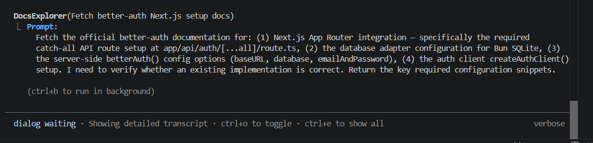

e mi ha trovato del codice che manca in base alla documentazione di better-auth
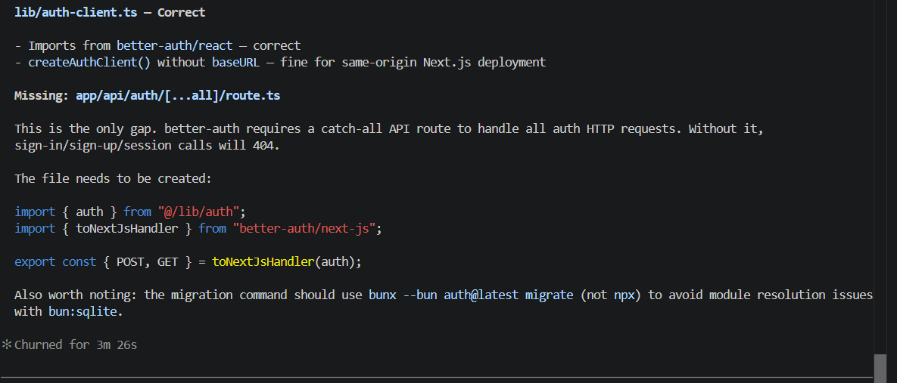

[Commit: aggiunta di next cookies da better auth](https://github.com/simotae14/claude-code-practical-guide/commit/de75e1f0e6f1f7317c4562df8c2eafd4909a1d22)

## Intoducing Agent Skills
Vediamo il grafo delle Agent Skills
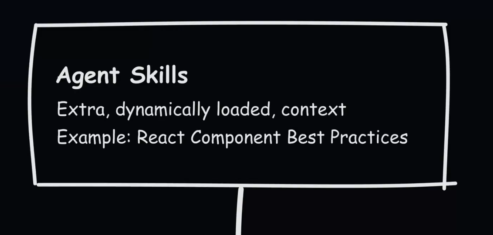
<https://agentskills.io/home>
praticamente vanno ad arricchire il context
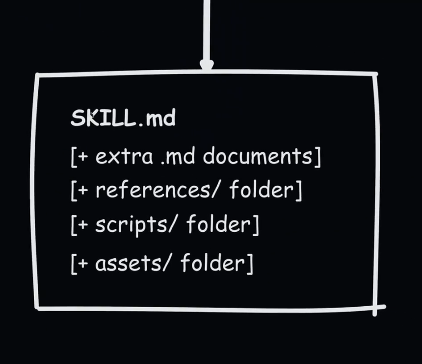
oltre al markdown può contenere altri file opzionali ed anche scripts
ref <https://agentskills.io/home>

## Adding Custom Skills
Per aggiungerne una locale basta aggiungere una cartella <em>skills</em> nella cartella <em>.claude</em>
Dentro questa cartella devi creare una cartella per ogni skill
ad es creo cartella <em>modern-best-practice-react-components</em> e poi dentro ogni cartella bisogna creare un file <em>SKILL.md</em> e dobbiamo usare sto nome.
Dentro vado ad aggiungere alcuni metadati, e quelli required sono name e description, dove il nome deve prendere il nome della folder della skill
[Doc metadata fields disponibili](https://code.claude.com/docs/en/plugins-reference#metadata-fields)
Tra i metadata puoi scegliere di permettergli di accedere a un numero limitato di tools usando <em>allowed-tools</em>, oppure <em>context</em> se vogliamo fargli accedere al context
Dentro la skill puoi mettere riferimenti ad altri documenti md che vanno ad approfondire determinate tematiche, come la ref che mettiamo agli useEffect

Ovviamente puoi avere delle Skills globali dentro la cartella .claude generale. Per poterli condividere fra i vari progetti.
[Commit: Create Custom Skill](https://github.com/simotae14/claude-code-practical-guide/commit/178b7e83cedb4a225e3bcd2d23d45a94b02b382b)

Ora se vado direttamente in claude con questo prompt
```
Let's add a proper authentication route / page content to this app. We only support email + password auth.
Users can switch between models, implemented via search params.

No password resetting for this demo app
```

Una volta elaborato il piano gli diciamo che non vogliamo collezionare il nome utente


e lo eseguo in plan mode

Una volta finito gli chiedo se ha fatto tutto per bene

```
Did you implement the component using React best practices and clean, modern HTML / JSX + Tailwind?
```
che usa la nostra nuova skill
[Commit: definizione Custom Skill e implementazione autenticazione](https://github.com/simotae14/claude-code-practical-guide/commit/371d723f64c24c735dcc54c929b10ddf02111fdb)

Bun Skill
[Commit: Aggiunta Bun Skill](https://github.com/simotae14/claude-code-practical-guide/commit/8599e99fd7357afa77621c566a4d6d7b0130c0bd)

Clean Typescript Skill
[Commit: Write Clean Typescript Skill]()

## Skills Metadata:

<https://code.claude.com/docs/en/skills#frontmatter-reference>

## Skills Package:

<https://github.com/academind/claude-code-course-resources/blob/main/other/skills.zip>

## Code Review Command:

<https://github.com/academind/claude-code-course-resources/blob/main/other/commands/code-review.md>

## Hook Events:

<https://code.claude.com/docs/en/hooks#hook-events>

## Creating Custom Plugins:

<https://code.claude.com/docs/en/plugins>

## Ralph Loop Project:

<https://github.com/academind/claude-code-course-resources/blob/main/code-snapshots/ralph-loop.zip>
